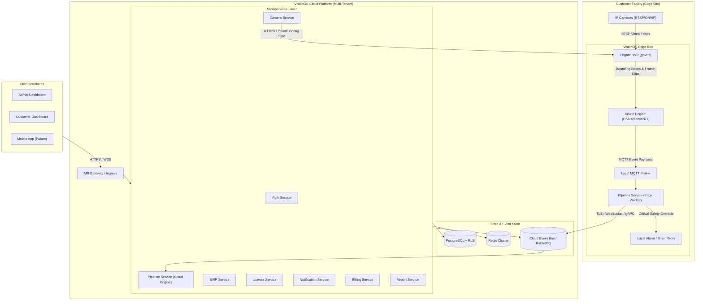
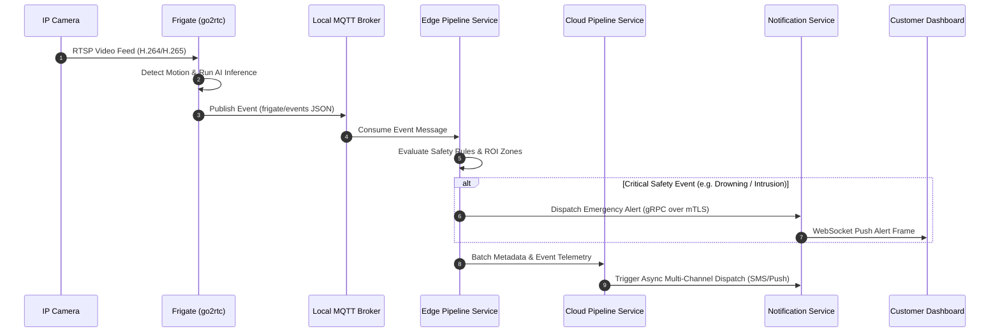
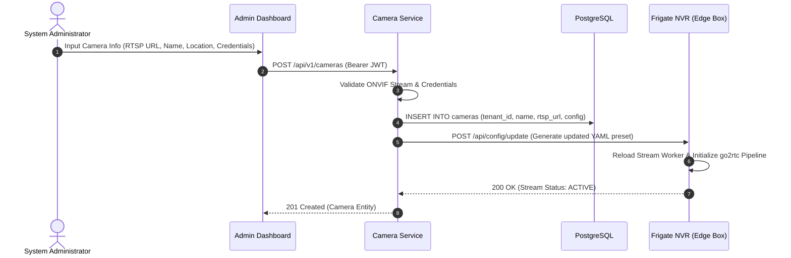
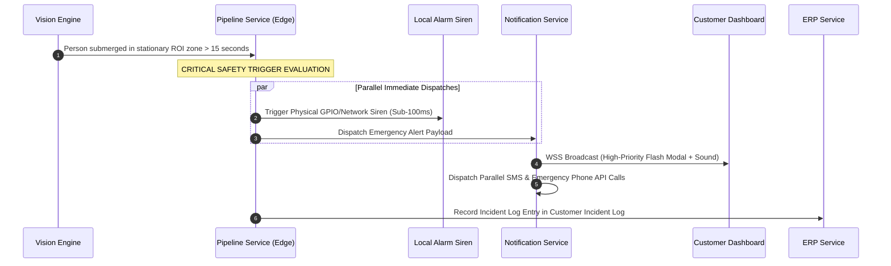
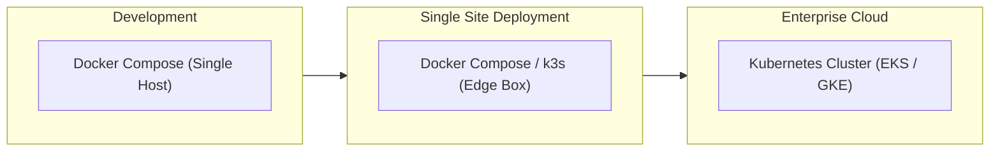
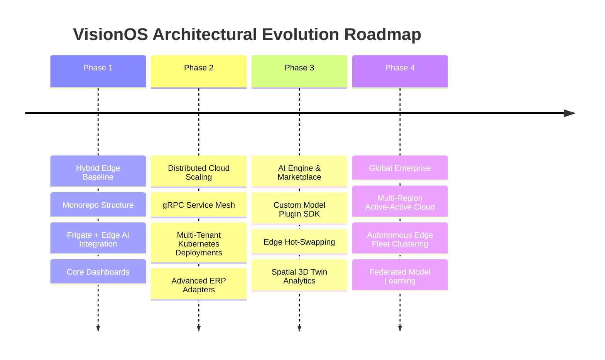

# VisionOS System Architecture & Design Specification

**Document Version:** 1.0.0  
**Status:** Approved Specification  
**Classification:** Enterprise Technical Reference  
**Target Audience:** Enterprise Software Architects, DevOps Engineers, CV Engineers, Platform Developers

---

## 1. VisionOS Overview

### 1.1 Project Purpose
**VisionOS** is an enterprise-grade, hybrid edge-cloud AI vision intelligence platform. It bridges local Network Video Recorders (NVRs) and real-time computer vision inference with cloud-hosted business automation, multi-tenant administrative portals, life-safety alert systems, and Enterprise Resource Planning (ERP) integrations.

The platform is designed for high-concurrency commercial deployments—such as hospitality, industrial facilities, logistics hubs, and safety-critical environments (e.g., swimming pool drowning detection, perimeter intrusion, inventory movements).

### 1.2 Business Goals
- **Sub-Second Incident Response**: Deliver life-safety alerts (e.g., drowning prevention, critical perimeter breaches) to onsite personnel in under 1,000 milliseconds from frame capture.
- **Hybrid Edge-Cloud Resiliency**: Maintain continuous, autonomous local video recording, AI processing, and safety alerting even during cloud internet connection outages.
- **Operational Automation**: Convert physical video events (footfall, dwell time, object movement) into actionable ERP business transactions (SAP, Odoo, QuickBooks).
- **Scalable Multi-Tenant Operations**: Support expansion from a single property deployment to thousands of distributed enterprise facilities under a unified control plane.
- **Zero-Trust Hardware & Licensing Control**: Enforce cryptographically signed hardware licensing and tenant feature entitlements.

### 1.3 High-Level Architecture

VisionOS operates on a **Distributed Edge-Cloud Topology**:
- **Edge Layer**: Deployed on-premise at customer facilities. Executes video stream ingestion, motion gating, hardware-accelerated AI object detection, and local alarm dispatching.
- **Cloud Control Plane**: Centralized multi-tenant cloud environment managing authentication, tenant configuration, analytics aggregation, ERP synchronization, billing, and long-term reporting.



---

## 2. System Components

### 2.1 Admin Dashboard (`apps/admin-dashboard`)
Web management portal for VisionOS super-administrators and platform operations.
- **Responsibilities**: Global tenant provisioning, system feature flag toggles, global license management, infrastructure telemetry monitoring (edge node health, CPU/GPU temperature, FPS counters), and global audit logs.

### 2.2 Customer Dashboard (`apps/customer-dashboard`)
Web portal for enterprise clients, property security teams, and facility managers.
- **Responsibilities**: Live stream viewing via WebRTC/MSE, interactive incident timeline player, real-time alert feed, analytics charts, ERP sync settings, user management, and billing management.

### 2.3 Auth Service (`services/auth-service`)
Identity, authentication, and access control microservice.
- **Responsibilities**: User registration/login, MFA, OAuth2/OIDC SSO integration, RS256 JWT key pair generation, token verification, and granular Role-Based Access Control (RBAC) validation.

### 2.4 ERP Service (`services/erp-service`)
Integration hub connecting physical vision events with external enterprise management platforms.
- **Responsibilities**: Standardized data translation adapters for SAP, Odoo, NetSuite, QuickBooks, and custom REST/GraphQL webhooks. Manages retry queues and event mapping rules.

### 2.5 License Service (`services/license-service`)
Software entitlement and license key management service.
- **Responsibilities**: Generating and validating cryptographically signed online/offline license keys, enforcing maximum camera stream counts, feature flag gating, and handling edge heartbeat telemetry verification.

### 2.6 Camera Service (`services/camera-service`)
Central registry and management plane for IP camera hardware.
- **Responsibilities**: ONVIF discovery, network camera probing, RTSP stream URL provisioning, PTZ control dispatching, and syncing camera definitions down to edge `infra/frigate-config` YAML templates.

### 2.7 Pipeline Service (`services/pipeline-service`)
Stream processing and event orchestration service operating across Edge and Cloud.
- **Responsibilities**: Ingesting MQTT event payloads from Frigate/Vision Engine, applying region-of-interest (ROI) rules, enforcing event deduplication, evaluating safety thresholds, and routing events to downstream queues.

### 2.8 Vision Engine (`services/ai-custom-service`)
High-performance computer vision inference runtime.
- **Responsibilities**: Hosting custom deep learning models (ONNX Runtime, NVIDIA TensorRT, OpenVINO, PyTorch TorchScript). Performs object detection, semantic segmentation, tracking, non-maximum suppression (NMS), and custom event classification (e.g., drowning motion profiles, vehicle license plate recognition).

### 2.9 Notification Service (`services/notification-service`)
Multi-channel event dispatcher.
- **Responsibilities**: Delivering real-time alerts via persistent WebSockets (to dashboards), mobile push notifications (FCM/APNS), SMS (Twilio), Email (SMTP/SES), and automated emergency phone webhooks.

### 2.10 Report Service (`services/report-service`)
Analytics compilation and historical export engine.
- **Responsibilities**: Time-series rollup queries, footfall trends, heatmaps, peak operational window calculations, and automated background generation of PDF/CSV/XLSX export files.

### 2.11 Frigate NVR (`infra/frigate-config`)
Edge video ingestion, stream server (`go2rtc`), and motion gating engine.
- **Responsibilities**: Direct RTSP stream ingestion, zero-latency WebRTC/MSE re-streaming, pixel motion detection gating, and frame capture offloading.

### 2.12 PostgreSQL
Primary relational storage engine.
- **Responsibilities**: Storing tenant structures, user profiles, camera metadata, RBAC definitions, license states, and historical event indices using Row-Level Security (RLS) for tenant isolation.

### 2.13 Redis
High-performance in-memory cache and pub/sub broker.
- **Responsibilities**: Managing session tokens, API rate-limiting buckets, live camera stream status caching, real-time WebSocket connection state, and transient message queues.

### 2.14 MQTT Broker
Lightweight edge-to-cloud messaging broker (Mosquitto/EMQX).
- **Responsibilities**: Zero-latency publish/subscribe transport for edge AI events, hardware status heartbeats, and local alarm triggers.

---

## 3. Edge vs Cloud Architecture

VisionOS divides responsibilities strictly between Edge and Cloud to guarantee life-safety uptime while maintaining centralized control.

| Capability / Responsibilities | Edge Box (On-Premise) | Cloud Platform | Customer Browser | Mobile App (Future) |
| :--- | :---: | :---: | :---: | :---: |
| **RTSP Video Stream Ingestion** | **Primary** | - | - | - |
| **Hardware Video Motion Gating** | **Primary** | - | - | - |
| **Local AI Inference (ONNX/TensorRT)**| **Primary** | Optional (Heavy Analytics) | - | - |
| **Life-Safety Local Alarm Trigger** | **Primary** | Backup | - | - |
| **RTSP to WebRTC Stream Remuxing** | **Primary** | - | - | - |
| **Multi-Tenant User Auth & JWT** | Verification Only | **Primary** | - | - |
| **Global Database & Historical Storage**| Local Buffer (7 days) | **Primary (Long term)** | - | - |
| **ERP Systems Integration** | - | **Primary** | - | - |
| **Multi-Channel Push Notifications** | Local Siren/Relay | **Primary (SMS/FCM/Email)**| WebSocket Receiver | Push Receiver |
| **Global License Entitlement Check** | Verification Only | **Primary** | - | - |
| **UI Rendering & Stream Playback** | - | - | **Primary** | **Primary** |

---

## 4. Communication Flow

### 4.1 System Communication Protocol Matrix

```
Client Apps ───────────(HTTPS / WSS)──────────► API Gateway / Services
Services    ───────────(SQL / Connection Pool)► PostgreSQL
Services    ───────────(RESP / TCP)───────────► Redis Cluster
Camera Svc  ───────────(REST API / gRPC)──────► Frigate NVR
Frigate     ───────────(MQTT Pub / TCP)───────► Local MQTT Broker
MQTT Broker ───────────(MQTT Sub / TCP)───────► Pipeline Service (Edge)
Pipeline    ───────────(mTLS / gRPC)──────────► Cloud Event Bus
Cloud Event ───────────(AMQP / gRPC)──────────► Notification / ERP Services
```



---

## 5. Request Flow Scenarios

### 5.1 Scenario A: A New Camera is Added



### 5.2 Scenario B: A Person is Detected

1. **Frame Capture**: IP Camera streams 1080p RTSP video at 25 FPS to Frigate NVR.
2. **Motion Detection**: Frigate's pixel motion detector identifies movement within configured camera zones.
3. **Inference Trigger**: Motion-gated frames are dispatched to the `ai-custom-service` (Vision Engine) running on an ONNX/TensorRT GPU pipeline.
4. **Bounding Box Generation**: Vision Engine detects a `person` object with `confidence: 0.94` and bounding box coordinates `[x_min, y_min, x_max, y_max]`.
5. **MQTT Publication**: Frigate publishes a structured JSON payload to topic `frigate/pool_camera/events`:
   ```json
   {
     "type": "update",
     "event_id": "evt_102938474",
     "camera": "pool_camera_01",
     "label": "person",
     "confidence": 0.94,
     "box": [120, 340, 210, 580]
   }
   ```
6. **Pipeline Ingestion**: `pipeline-service` consumes the MQTT message, appends tenant contextual metadata, and updates spatial tracking models in Redis.

### 5.3 Scenario C: A Drowning Event Occurs (Critical Life-Safety Flow)



### 5.4 Scenario D: A Notification is Sent

1. `notification-service` receives an alert event payload containing `{ tenant_id, alert_level: "CRITICAL", title, message, clip_url }`.
2. **Preference Lookup**: Queries Redis for active tenant notification routes and user preferences.
3. **Channel Fanout**:
   - **WebSocket**: Broadcasts payload to active client sockets connected under `tenant_id`.
   - **Mobile Push**: Dispatches push notification payload to Apple APNS / Firebase FCM worker queue.
   - **SMS / Telephony**: Dispatches webhooks to SMS providers (Twilio/Amazon SNS).
4. **Audit Log**: Writes delivery receipts and timestamps into PostgreSQL `notification_logs`.

---

## 6. Security Architecture

```
┌─────────────────────────────────────────────────────────────────────────┐
│                          Security Layer Boundaries                      │
├─────────────────────────────────────────────────────────────────────────┤
│ [Edge & Cloud Traffic]    TLS 1.3 Encryption / Mutual TLS (mTLS)       │
│ [Authentication]         JSON Web Tokens (JWT) with RS256 Asymmetric Keys│
│ [Authorization]          Granular Role-Based Access Control (RBAC)      │
│ [Data Isolation]         Multi-Tenant Row-Level Security (RLS) in DB    │
│ [License Protection]     Cryptographic Hardware ID (HWID) RSA Signatures│
│ [Secrets Management]     Centralized Vault / Environment Encryption     │
└─────────────────────────────────────────────────────────────────────────┘
```

### 6.1 Authentication & Tokens (JWT)
- **Asymmetric Signing**: Access tokens are signed using RS256 / ES256 key pairs managed by `auth-service`. Microservices verify tokens using public keys cached from JWKS endpoints.
- **Short-Lived Tokens**: Access tokens expire in 15 minutes. Refresh tokens are stored in HttpOnly, SameSite=Strict cookies with Redis session revocation.

### 6.2 Role-Based Access Control (RBAC)
- Fine-grained permission strings (`camera:read`, `camera:write`, `alert:dismiss`, `tenant:admin`) mapped to roles (`SuperAdmin`, `TenantAdmin`, `Operator`, `Viewer`).

### 6.3 Multi-Tenant Isolation
- **Database Row-Level Security (RLS)**: PostgreSQL enforces `tenant_id` session variables on every transaction. Direct query attempts across tenants are rejected at the database engine level.
- **Logical Queue Isolation**: Redis and MQTT topic structures are strictly scoped by tenant (`visionos/<tenant_id>/...`).

### 6.4 Cryptographic Hardware Licensing
- **License Signing**: Licenses are signed offline by VisionOS PKI using RSA-4096.
- **HWID Binding**: The `license-service` extracts CPU serial numbers, MAC addresses, and motherboard UUIDs on the Edge Box to bind license validity to specific physical hardware.

### 6.5 Encryption & Secrets Management
- **Transit Security**: All external communications enforce TLS 1.3. Edge-to-cloud service communication uses mTLS with client certificates.
- **Secrets**: API keys, database credentials, and RTSP camera passwords are stored encrypted using AES-256-GCM.

---

## 7. Deployment Architecture

VisionOS supports flexible, containerized deployment models spanning development setups to enterprise cloud clusters.



### 7.1 Docker & Multi-Stage Builds
- Services are containerized using distroless, multi-stage Dockerfiles for minimal surface area and small image footprints.

### 7.2 Docker Compose Deployment Profiles
- **`docker-compose.yml`**: Base local developer environment.
- **`docker-compose.edge.yml`**: Optimized edge deployment profile mounting GPU device drivers (`/dev/nvidia*`, Coral TPU USB nodes), local MQTT, and Frigate containers.
- **`docker-compose.prod.yml`**: Multi-container cloud deployment with healthchecks, restart policies, and log rotation drivers.

### 7.3 Future Kubernetes Orchestration
- **Edge Sites**: Lightweight **k3s** clusters for multi-node on-premise hardware deployments.
- **Cloud Control Plane**: Managed **Kubernetes (EKS/GKE)** with Horizontal Pod Autoscaling (HPA), KEDA event-driven autoscaling for microservices, and ingress controllers managing SSL termination.

---

## 8. Scalability Strategy

VisionOS scales seamlessly from single-site operations to global multi-facility enterprises.

```
┌─────────────────┐      ┌──────────────────┐      ┌───────────────────┐      ┌────────────────────┐
│    1 Hotel      │─────►│    10 Hotels     │─────►│    100 Hotels     │─────►│    1000 Hotels     │
│ 1 Edge Box      │      │ 10 Edge Boxes    │      │ 100 Edge Boxes    │      │ 1000 Edge Boxes    │
│ 10 Cameras      │      │ 100 Cameras      │      │ 1,000 Cameras     │      │ 10,000 Cameras     │
│ Single Cloud DB │      │ Multi-Tenant DB  │      │ DB Read Replicas  │      │ Multi-Region Cloud │
└─────────────────┘      └──────────────────┘      └───────────────────┘      └────────────────────┘
```

### 8.1 1 Hotel (1 Edge Box, ~10 Cameras)
- **Topology**: 1 Edge Box running Docker Compose (Frigate + Vision Engine + Edge Pipeline). Single-tenant cloud database instance.
- **Bottlenecks**: None. Edge GPU handles local AI streams; Cloud handles minimal metadata.

### 8.2 10 Hotels (10 Edge Boxes, ~100 Cameras)
- **Topology**: 10 independent Edge Boxes publishing events to a shared multi-tenant Cloud API Gateway.
- **Data Layer**: Central PostgreSQL database with Tenant Row-Level Security (RLS). Redis caching layer introduced for API rate-limiting and active WebSocket state.

### 8.3 100 Hotels (100 Edge Boxes, ~1,000 Cameras)
- **Topology**: 100 Edge Boxes. Cloud platform migrated to Kubernetes (EKS/GKE).
- **Data Layer**: Primary-Replica PostgreSQL architecture (1 Write Primary, 3 Read Replicas). Dedicated RabbitMQ/NATS cluster for async event handling. Automated Camera Service edge fleet config pushes.

### 8.4 1,000 Hotels (1,000 Edge Boxes, ~10,000 Cameras)
- **Topology**: Global active-active multi-region cloud deployment (US, EU, APAC). Edge boxes connect to nearest regional cloud ingress.
- **Data Layer**: Sharded PostgreSQL databases, TimescaleDB time-series partitioning for historical vision metrics, distributed Kafka/NATS event streaming backbone, and CDN edge video caching.

---

## 9. Core Design Principles

1. **Single Responsibility Principle (SRP)**: Each package, component, and microservice owns a single domain boundary.
2. **Modular Monolith First**: Built cleanly inside a monorepo (`apps/`, `services/`, `packages/`). Enables single-process development while keeping service boundaries clean for independent microservice containerization.
3. **API-First Specification**: All inter-service and client communications strictly follow OpenAPI 3.0 / gRPC Protobuf schemas defined before code implementation.
4. **Event-Driven Architecture**: Core workflows communicate asynchronously via MQTT, Redis, and RabbitMQ message brokers, ensuring high throughput and resilience to service outages.
5. **Plugin-Ready Extensibility**: Designed with standardized connectors for custom AI models (`services/ai-custom-service`) and third-party ERP platforms (`services/erp-service`).
6. **Cloud-Native Resiliency**: Stateless compute services, 12-factor configuration via environment variables, automated health checks, and graceful shutdown handling.

---

## 10. Future Architectural Evolution



### 10.1 Microservice Mesh Transition
Migrate inter-service HTTP calls to high-performance **gRPC Protobuf** with **Istio / Linkerd** service mesh for automatic mTLS, traffic splitting, and distributed tracing (OpenTelemetry).

### 10.2 Vision AI Plugin & Model Marketplace
Expose an SDK allowing third-party machine learning developers to package custom ONNX/TensorRT models into VisionOS, dynamically loading them onto edge nodes via `services/ai-custom-service`.

### 10.3 Real-Time Spatial Analytics & 3D Twin Engine
Enhance `customer-dashboard` with 3D WebGL facility floorplans, projecting camera detection bounding boxes in real time onto a spatial digital twin map.

### 10.4 Federated Edge Learning & Multi-Region Clusters
Implement privacy-preserving federated model training across Edge Boxes to continuously improve drowning detection and object recognition accuracy without transferring raw customer video frames to the cloud.
