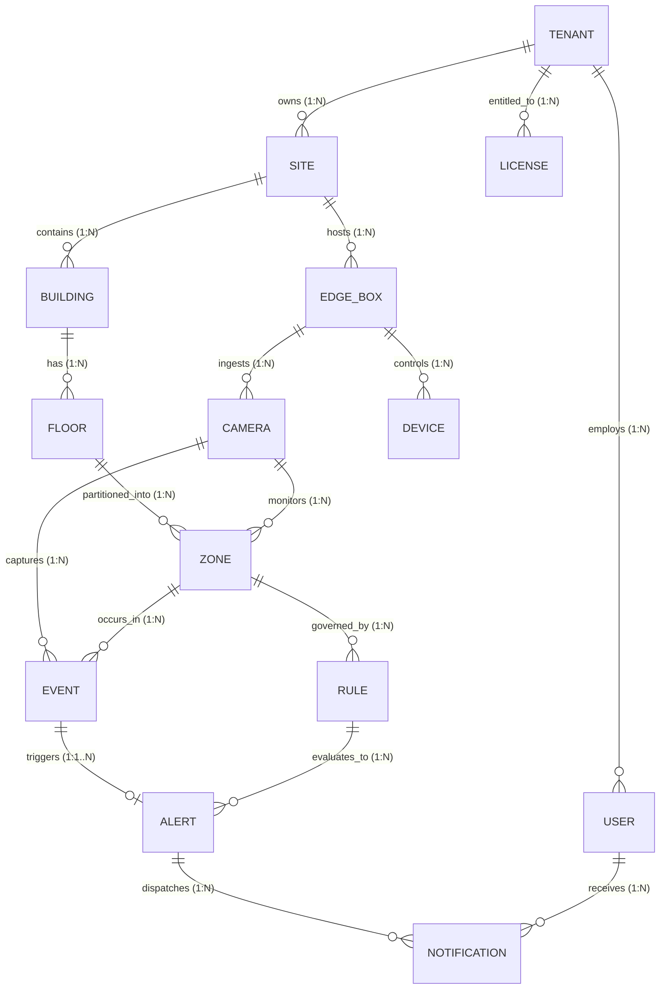

# VisionOS Domain Diagram & Relationship Specifications

This document illustrates the entity relationship model, ownership hierarchy, and relationship cardinalities for the **VisionOS** business domain.

---

## 1. Entity Relationship Diagram (ERD)



---

## 2. Ownership & Containment Hierarchy

The domain follows a strict multi-tenant ownership tree:

```
TENANT (Root Multi-Tenant Security Boundary)
 ├── LICENSE (Cryptographic Entitlements & Quotas)
 ├── USER (Identities & RBAC Roles)
 └── SITE (Physical Facilities)
      ├── EDGE_BOX (On-Premise Compute Nodes)
      │    ├── CAMERA (RTSP Stream Sources)
      │    └── DEVICE (Hardware I/O & Sirens)
      └── BUILDING (Architectural Structures)
           └── FLOOR (Elevations & Floorplans)
                └── ZONE (Regions of Interest)
                     ├── RULE (Policy Definitions)
                     └── EVENT (Vision Observations)
                          └── ALERT (Safety Incidents)
                               └── NOTIFICATION (Dispatches)
```

---

## 3. Relationship Cardinality Matrix

| Parent Entity | Child Entity | Relationship Type | Cardinality | Business Rules |
| :--- | :--- | :--- | :---: | :--- |
| **Tenant** | **User** | One-to-Many | `1 : N` | A tenant employs multiple users; a user belongs to exactly one tenant. |
| **Tenant** | **Site** | One-to-Many | `1 : N` | A tenant operates multiple physical sites. |
| **Tenant** | **License** | One-to-Many | `1 : N` | A tenant holds one or more license entitlement keys. |
| **Site** | **Building** | One-to-Many | `1 : N` | A site contains one or more physical buildings. |
| **Site** | **Edge Box** | One-to-Many | `1 : N` | A site hosts one or more on-premise Edge Boxes. |
| **Building** | **Floor** | One-to-Many | `1 : N` | A building is divided into horizontal floors. |
| **Floor** | **Zone** | One-to-Many | `1 : N` | A floor is partitioned into spatial ROI zones. |
| **Edge Box** | **Camera** | One-to-Many | `1 : N` | An Edge Box ingests RTSP video streams from multiple cameras. |
| **Edge Box** | **Device** | One-to-Many | `1 : N` | An Edge Box controls multiple peripheral devices (sirens, relays). |
| **Camera** | **Zone** | One-to-Many | `1 : N` | A camera feed monitors one or more ROI zones. |
| **Camera** | **Event** | One-to-Many | `1 : N` | A camera feed continuously generates raw detection events. |
| **Zone** | **Event** | One-to-Many | `1 : N` | Vision events are tagged with spatial zone boundaries. |
| **Zone** | **Rule** | One-to-Many | `1 : N` | A zone is governed by policy rules (intrusion, drowning, occupancy). |
| **Event** | **Alert** | One-to-One/Many | `1 : 0..N` | Matching events trigger evaluated alerts based on rule thresholds. |
| **Rule** | **Alert** | One-to-Many | `1 : N` | A rule generates alerts when event conditions exceed thresholds. |
| **Alert** | **Notification** | One-to-Many | `1 : N` | An alert dispatches multi-channel notifications (SMS, Push, WebSockets). |
| **User** | **Notification** | One-to-Many | `1 : N` | A user receives directed notifications based on recipient preferences. |
